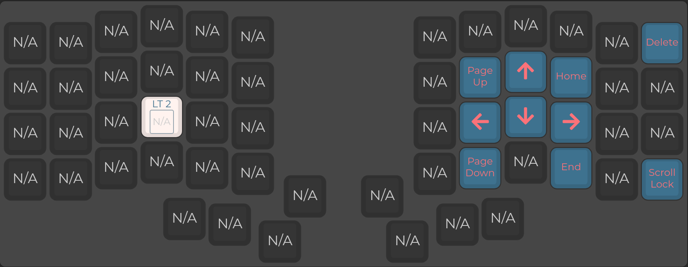
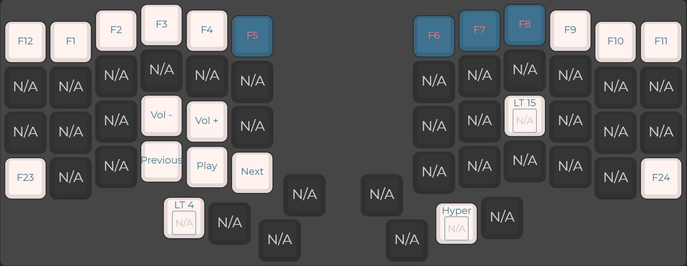

# IRIS KEYBOARD rev.8

## JSON configuration file
for compiling in [QMK Configurator](https://config.qmk.fm/#/kudox_game/rev2/LAYOUT).

## UF2 file
compiled file for keyboard

## Layers
### Layer 0 (writing, default)

### Layer 1 (Navigation layer)

### Layer 2 (Numpad layer)

### Layer 3 (Media and Fkeys layer)

### Layer 4 (Gaming layer)

### Layer 15 (Keyboard config layer)
